# 🏗️ Sistem Mimarisi
## Dijital Reçete Tabanlı Boya & Kimyasal Tüketim İzleme Sistemi

**Versiyon:** 1.0  
**Tarih:** Ocak 2026

---

## 1. Genel Bakış

### 1.1 Mimari Özet

Sistem, modern bir üç katmanlı mimari üzerine inşa edilmiştir:

- **Frontend:** React/Next.js tabanlı SPA (Single Page Application)
- **Backend:** Supabase (PostgreSQL + Auth + Realtime + Storage)
- **Workflow Engine:** n8n (Arka planda çalışan otomasyon)

### 1.2 Mimari Prensipler

| Prensip | Açıklama |
|---------|----------|
| Modülerlik | Her modül bağımsız geliştirilebilir |
| Güvenlik | RLS ile satır bazlı güvenlik |
| Ölçeklenebilirlik | Supabase otomatik ölçekleme |
| İzlenebilirlik | Tüm işlemler loglanır |
| Basitlik | Kullanıcı dostu arayüz |

---

## 2. Sistem Mimarisi Diyagramı

### 2.1 Üst Düzey Mimari

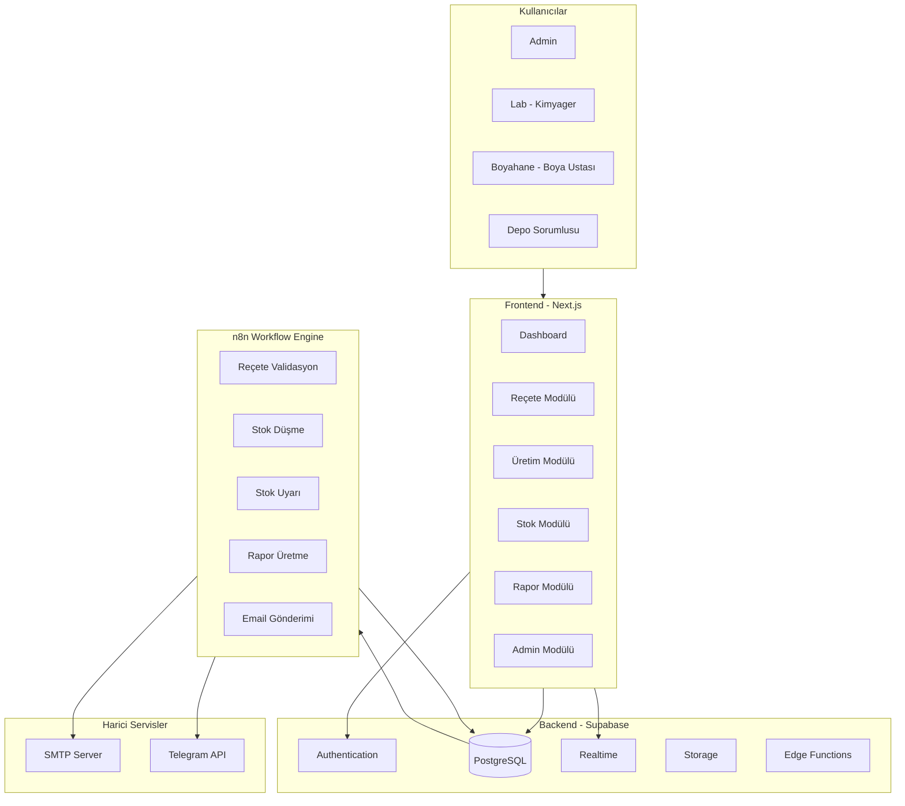

### 2.2 Veri Akış Diyagramı

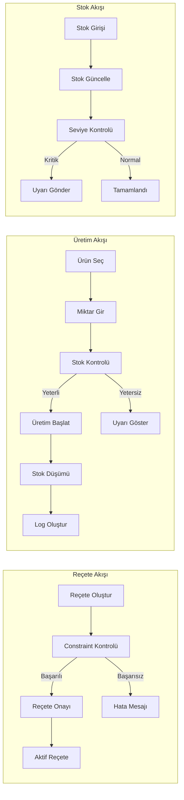

---

## 3. Bileşen Mimarisi

### 3.1 Frontend Bileşenleri

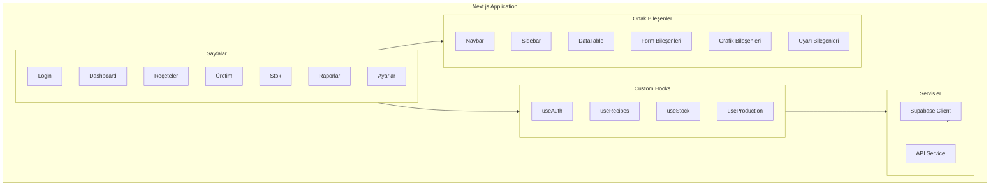

### 3.2 Rol Bazlı Sayfa Erişimi

| Sayfa | Admin | Lab | Boyahane | Depo |
|-------|-------|-----|----------|------|
| Dashboard | ✅ | ✅ | ✅ | ✅ |
| Reçeteler | ✅ | ✅ | ❌ | ❌ |
| Üretim | ✅ | ✅ | ✅ | ❌ |
| Stok | ✅ | ✅ | ❌ | ✅ |
| Raporlar | ✅ | ✅ | ❌ | ✅ |
| Ayarlar | ✅ | ❌ | ❌ | ❌ |
| Kullanıcılar | ✅ | ❌ | ❌ | ❌ |

---

## 4. Veritabanı Mimarisi

### 4.1 Entity Relationship Diyagramı

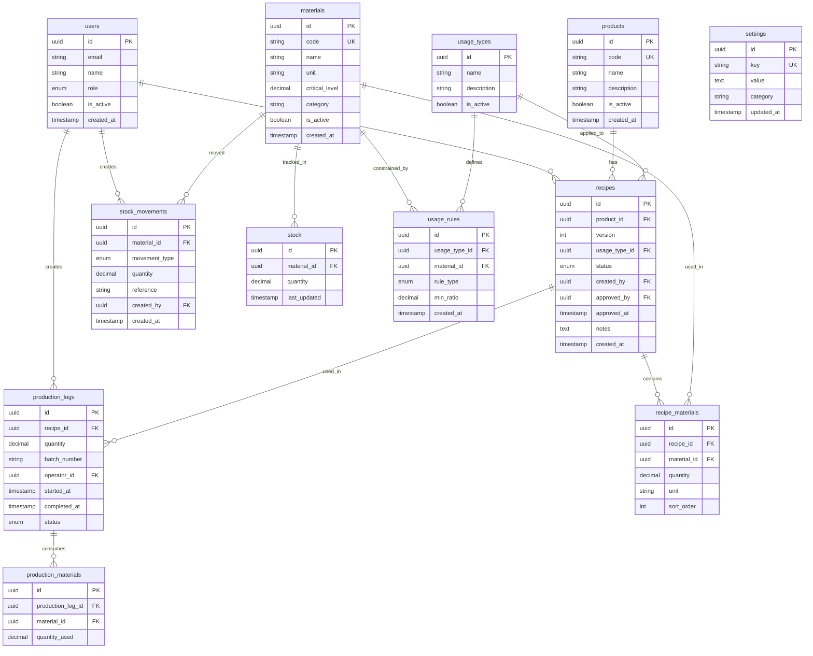

### 4.2 Tablo Özeti

| Tablo | Açıklama | Tahmini Kayıt |
|-------|----------|---------------|
| users | Sistem kullanıcıları | 10-50 |
| products | Ürün/ton tanımları | 100-500 |
| recipes | Reçeteler (versiyonlu) | 500-2000 |
| recipe_materials | Reçete bileşenleri | 2000-10000 |
| materials | Kimyasallar | 50-200 |
| stock | Stok durumu | 50-200 |
| stock_movements | Stok hareketleri | 10000+ |
| usage_types | Kullanım tipleri | 5-20 |
| usage_rules | Kısıt kuralları | 50-200 |
| production_logs | Üretim kayıtları | 5000+ |
| production_materials | Üretim malzemeleri | 25000+ |
| settings | Sistem ayarları | 20-50 |

---

## 5. n8n Workflow Mimarisi

### 5.1 Workflow Genel Görünümü

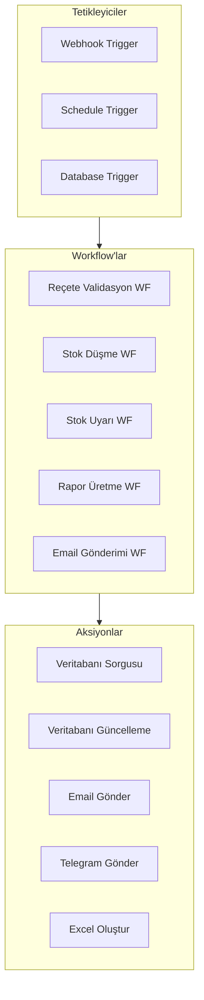

### 5.2 Workflow Detayları

#### WF1: Reçete Validasyon Workflow

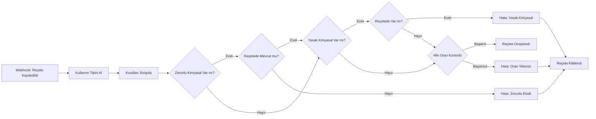

**Tetikleyici:** Webhook (Reçete kaydedildiğinde)

**Adımlar:**
1. Reçete bilgilerini al
2. Kullanım tipine göre kuralları sorgula
3. Zorunlu kimyasalları kontrol et
4. Yasak kimyasalları kontrol et
5. Minimum oranları kontrol et
6. Sonucu veritabanına yaz

#### WF2: Stok Düşme Workflow

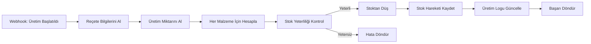

**Tetikleyici:** Webhook (Üretim başlatıldığında)

**Adımlar:**
1. Üretim bilgilerini al
2. Reçete malzemelerini çek
3. Her malzeme için: miktar = reçete_oranı × üretim_miktarı
4. Stok yeterliliğini kontrol et
5. Transaction içinde stokları düş
6. Stok hareketlerini kaydet
7. Üretim logunu güncelle

#### WF3: Stok Uyarı Workflow

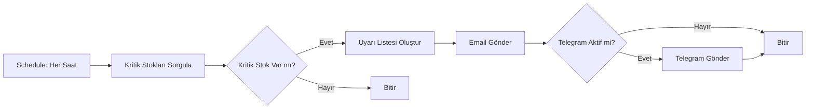

**Tetikleyici:** Schedule (Her saat başı)

**Adımlar:**
1. Kritik seviye altındaki stokları sorgula
2. Uyarı listesi oluştur
3. İlgili kişilere email gönder
4. Telegram aktifse bildirim gönder

#### WF4: Rapor Üretme Workflow

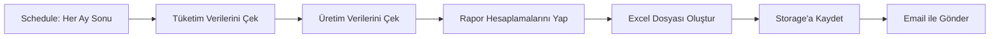

**Tetikleyici:** Schedule (Aylık)

**Adımlar:**
1. Dönem içi tüketim verilerini çek
2. Üretim istatistiklerini hesapla
3. Excel raporu oluştur
4. Supabase Storage'a kaydet
5. İlgili kişilere email gönder

#### WF5: Email Gönderimi Workflow

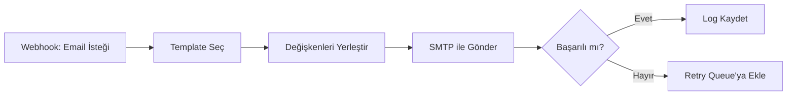

**Tetikleyici:** Webhook (Diğer workflow'lardan)

**Adımlar:**
1. Email tipine göre template seç
2. Dinamik değişkenleri yerleştir
3. SMTP üzerinden gönder
4. Sonucu logla

---

## 6. API Endpoint Listesi

### 6.1 Authentication Endpoints

| Method | Endpoint | Açıklama | Yetki |
|--------|----------|----------|-------|
| POST | /auth/login | Kullanıcı girişi | Public |
| POST | /auth/logout | Çıkış | Authenticated |
| POST | /auth/refresh | Token yenileme | Authenticated |
| POST | /auth/reset-password | Şifre sıfırlama | Public |

### 6.2 User Endpoints

| Method | Endpoint | Açıklama | Yetki |
|--------|----------|----------|-------|
| GET | /api/users | Kullanıcı listesi | Admin |
| GET | /api/users/:id | Kullanıcı detayı | Admin |
| POST | /api/users | Yeni kullanıcı | Admin |
| PUT | /api/users/:id | Kullanıcı güncelle | Admin |
| DELETE | /api/users/:id | Kullanıcı sil | Admin |

### 6.3 Product Endpoints

| Method | Endpoint | Açıklama | Yetki |
|--------|----------|----------|-------|
| GET | /api/products | Ürün listesi | Lab, Admin |
| GET | /api/products/:id | Ürün detayı | Lab, Admin |
| POST | /api/products | Yeni ürün | Lab, Admin |
| PUT | /api/products/:id | Ürün güncelle | Lab, Admin |
| DELETE | /api/products/:id | Ürün pasif yap | Admin |

### 6.4 Recipe Endpoints

| Method | Endpoint | Açıklama | Yetki |
|--------|----------|----------|-------|
| GET | /api/recipes | Reçete listesi | Lab, Admin |
| GET | /api/recipes/:id | Reçete detayı | Lab, Admin, Boyahane |
| GET | /api/recipes/:id/versions | Versiyon geçmişi | Lab, Admin |
| POST | /api/recipes | Yeni reçete | Lab |
| POST | /api/recipes/:id/version | Yeni versiyon | Lab |
| PUT | /api/recipes/:id/approve | Reçete onayla | Lab |
| GET | /api/recipes/active | Aktif reçeteler | Boyahane |

### 6.5 Material Endpoints

| Method | Endpoint | Açıklama | Yetki |
|--------|----------|----------|-------|
| GET | /api/materials | Malzeme listesi | All |
| GET | /api/materials/:id | Malzeme detayı | All |
| POST | /api/materials | Yeni malzeme | Admin |
| PUT | /api/materials/:id | Malzeme güncelle | Admin |
| DELETE | /api/materials/:id | Malzeme pasif yap | Admin |

### 6.6 Stock Endpoints

| Method | Endpoint | Açıklama | Yetki |
|--------|----------|----------|-------|
| GET | /api/stock | Stok listesi | Depo, Admin |
| GET | /api/stock/:material_id | Malzeme stoku | Depo, Admin |
| POST | /api/stock/entry | Stok girişi | Depo |
| GET | /api/stock/critical | Kritik stoklar | Depo, Admin |
| GET | /api/stock/movements | Stok hareketleri | Depo, Admin |

### 6.7 Production Endpoints

| Method | Endpoint | Açıklama | Yetki |
|--------|----------|----------|-------|
| GET | /api/production | Üretim listesi | Boyahane, Admin |
| GET | /api/production/:id | Üretim detayı | Boyahane, Admin |
| POST | /api/production/start | Üretim başlat | Boyahane |
| PUT | /api/production/:id/complete | Üretim tamamla | Boyahane |
| GET | /api/production/today | Bugünkü üretimler | Boyahane |

### 6.8 Usage Rules Endpoints

| Method | Endpoint | Açıklama | Yetki |
|--------|----------|----------|-------|
| GET | /api/usage-types | Kullanım tipleri | Lab, Admin |
| GET | /api/usage-rules | Kural listesi | Lab, Admin |
| POST | /api/usage-rules | Yeni kural | Admin |
| PUT | /api/usage-rules/:id | Kural güncelle | Admin |
| DELETE | /api/usage-rules/:id | Kural sil | Admin |

### 6.9 Report Endpoints

| Method | Endpoint | Açıklama | Yetki |
|--------|----------|----------|-------|
| GET | /api/reports/consumption | Tüketim raporu | Depo, Admin |
| GET | /api/reports/production | Üretim raporu | Admin |
| GET | /api/reports/export/excel | Excel export | Depo, Admin |

### 6.10 Settings Endpoints

| Method | Endpoint | Açıklama | Yetki |
|--------|----------|----------|-------|
| GET | /api/settings | Ayarlar listesi | Admin |
| PUT | /api/settings/:key | Ayar güncelle | Admin |
| GET | /api/settings/email | Email ayarları | Admin |
| PUT | /api/settings/email | Email ayarları güncelle | Admin |

### 6.11 n8n Webhook Endpoints

| Method | Endpoint | Açıklama | Tetikleyen |
|--------|----------|----------|------------|
| POST | /webhook/recipe-validate | Reçete validasyonu | Frontend |
| POST | /webhook/production-start | Üretim başlatma | Frontend |
| POST | /webhook/stock-alert | Stok uyarısı | Scheduler |
| POST | /webhook/send-email | Email gönderimi | Internal |

---

## 7. Güvenlik Mimarisi

### 7.1 Güvenlik Katmanları

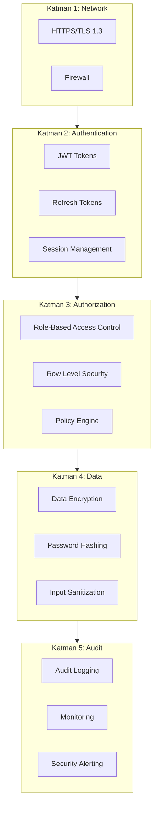

### 7.2 Authentication Flow

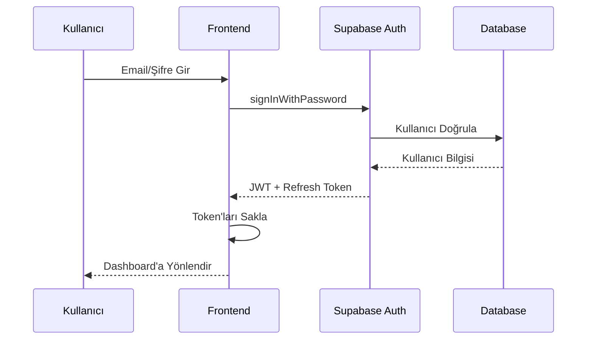

### 7.3 Row Level Security (RLS) Politikaları

| Tablo | Politika | Açıklama |
|-------|----------|----------|
| users | Admin only | Sadece admin tüm kullanıcıları görebilir |
| recipes | Role-based | Lab ve Admin tüm reçeteleri, Boyahane sadece aktif reçeteleri |
| stock | Role-based | Depo ve Admin stok görebilir |
| production_logs | Owner + Admin | Operatör kendi loglarını, Admin tümünü |
| settings | Admin only | Sadece admin ayarları görebilir |

### 7.4 API Güvenliği

| Önlem | Açıklama |
|-------|----------|
| Rate Limiting | IP başına dakikada 100 istek |
| Input Validation | Tüm girdiler validate edilir |
| SQL Injection | Parameterized queries |
| XSS Protection | Content Security Policy |
| CORS | Sadece izinli origin'ler |

---

## 8. Deployment Mimarisi

### 8.1 Deployment Diyagramı

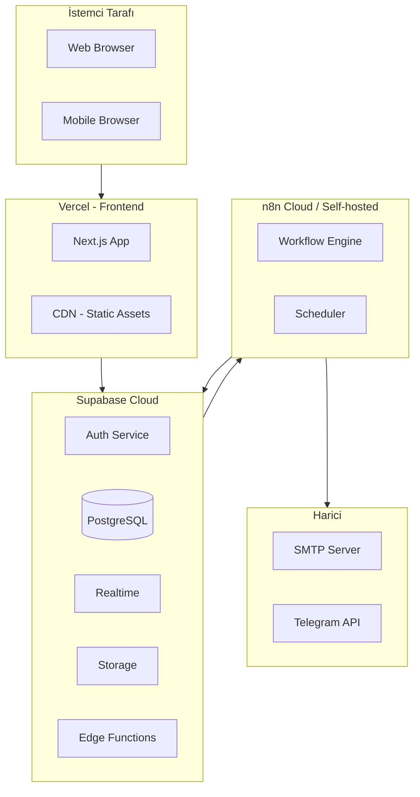

### 8.2 Environment Yapılandırması

| Environment | Kullanım | URL Pattern |
|-------------|----------|-------------|
| Development | Geliştirme | localhost:3000 |
| Staging | Test | staging.app.com |
| Production | Canlı | app.com |

### 8.3 Environment Variables

```
# Supabase
NEXT_PUBLIC_SUPABASE_URL=https://xxx.supabase.co
NEXT_PUBLIC_SUPABASE_ANON_KEY=xxx
SUPABASE_SERVICE_ROLE_KEY=xxx

# n8n
N8N_WEBHOOK_URL=https://n8n.xxx.com/webhook
N8N_API_KEY=xxx

# Email
SMTP_HOST=smtp.xxx.com
SMTP_PORT=587
SMTP_USER=xxx
SMTP_PASS=xxx

# Telegram (Optional)
TELEGRAM_BOT_TOKEN=xxx
TELEGRAM_CHAT_ID=xxx
```

---

## 9. Monitoring ve Logging

### 9.1 Monitoring Stack

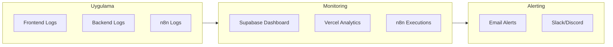

### 9.2 Log Seviyeleri

| Seviye | Kullanım |
|--------|----------|
| ERROR | Kritik hatalar, sistem arızaları |
| WARN | Uyarılar, potansiyel sorunlar |
| INFO | Önemli işlemler, audit log |
| DEBUG | Geliştirme amaçlı detaylı log |

### 9.3 Audit Log Yapısı

| Alan | Açıklama |
|------|----------|
| timestamp | İşlem zamanı |
| user_id | İşlemi yapan kullanıcı |
| action | İşlem tipi (CREATE, UPDATE, DELETE) |
| resource | Etkilenen kaynak |
| resource_id | Kaynak ID |
| old_value | Eski değer (JSON) |
| new_value | Yeni değer (JSON) |
| ip_address | İstemci IP |

---

## 10. Hata Yönetimi

### 10.1 Hata Kodları

| Kod | Açıklama |
|-----|----------|
| 400 | Bad Request - Geçersiz istek |
| 401 | Unauthorized - Kimlik doğrulama gerekli |
| 403 | Forbidden - Yetki yok |
| 404 | Not Found - Kaynak bulunamadı |
| 409 | Conflict - Çakışma (örn: duplicate) |
| 422 | Unprocessable Entity - Validasyon hatası |
| 500 | Internal Server Error - Sunucu hatası |

### 10.2 Hata Response Formatı

```json
{
  "error": {
    "code": "VALIDATION_ERROR",
    "message": "Reçetede zorunlu kimyasal eksik",
    "details": {
      "missing_materials": ["UV Stabilizer", "Fixer B"],
      "usage_type": "outdoor"
    }
  }
}
```

---

## 11. Performans Optimizasyonu

### 11.1 Frontend Optimizasyonları

| Teknik | Açıklama |
|--------|----------|
| Code Splitting | Sayfa bazlı lazy loading |
| Image Optimization | Next.js Image component |
| Caching | SWR ile client-side cache |
| Bundle Size | Tree shaking, minification |

### 11.2 Backend Optimizasyonları

| Teknik | Açıklama |
|--------|----------|
| Database Indexing | Sık sorgulanan alanlarda index |
| Connection Pooling | Supabase otomatik |
| Query Optimization | Gereksiz JOIN'lerden kaçınma |
| Pagination | Büyük listelerde sayfalama |

### 11.3 Önerilen İndeksler

```sql
-- Sık kullanılan sorgular için
CREATE INDEX idx_recipes_product_id ON recipes(product_id);
CREATE INDEX idx_recipes_status ON recipes(status);
CREATE INDEX idx_production_logs_date ON production_logs(started_at);
CREATE INDEX idx_stock_material_id ON stock(material_id);
CREATE INDEX idx_materials_code ON materials(code);
```

---

## 12. Gelecek Geliştirmeler

### 12.1 Planlanan Özellikler

| Özellik | Öncelik | Açıklama |
|---------|---------|----------|
| Mobil Uygulama | Orta | React Native ile native app |
| Barkod Entegrasyonu | Orta | Malzeme takibi için barkod |
| ERP Entegrasyonu | Düşük | Mevcut ERP ile senkronizasyon |
| AI Tahminleme | Düşük | Tüketim tahmini |
| Multi-tenant | Düşük | Çoklu fabrika desteği |

### 12.2 Ölçeklenebilirlik Planı

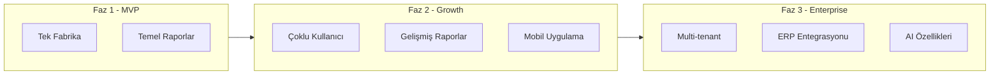

---

**Doküman Sonu**

*Bu mimari doküman, proje geliştirme sürecinde güncellenebilir.*
