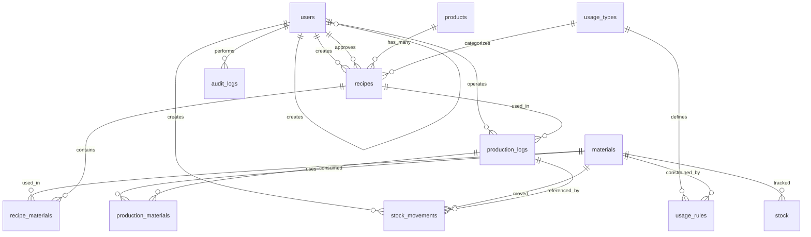

# 🗄️ Veritabanı Şeması
## Dijital Reçete Tabanlı Boya & Kimyasal Tüketim İzleme Sistemi

**Versiyon:** 1.0  
**Veritabanı:** PostgreSQL (Supabase)  
**Tarih:** Ocak 2026

---

## 1. Şema Genel Bakış

### 1.1 Tablo Listesi

| # | Tablo Adı | Açıklama | Kayıt Tipi |
|----|-----------|----------|------------|
| 1 | `users` | Sistem kullanıcıları | Ana Tablo |
| 2 | `products` | Ürün/ton tanımları | Ana Tablo |
| 3 | `recipes` | Reçeteler (versiyonlu) | Ana Tablo |
| 4 | `recipe_materials` | Reçete bileşenleri | İlişki Tablosu |
| 5 | `materials` | Kimyasallar/malzemeler | Ana Tablo |
| 6 | `stock` | Anlık stok durumu | Ana Tablo |
| 7 | `stock_movements` | Stok hareketleri | Log Tablosu |
| 8 | `usage_types` | Kullanım tipleri | Referans Tablo |
| 9 | `usage_rules` | Kısıt kuralları | Ana Tablo |
| 10 | `production_logs` | Üretim kayıtları | Ana Tablo |
| 11 | `production_materials` | Üretimde kullanılan malzemeler | Detay Tablo |
| 12 | `settings` | Sistem ayarları | Konfigürasyon |
| 13 | `audit_logs` | Denetim kayıtları | Log Tablosu |

---

## 2. Tablo Detayları

### 2.1 `users` - Kullanıcılar

Kullanıcı bilgileri ve yetkilendirme için Supabase Auth ile entegre çalışır.

```sql
CREATE TABLE users (
    id UUID PRIMARY KEY DEFAULT gen_random_uuid(),
    email VARCHAR(255) NOT NULL UNIQUE,
    name VARCHAR(255) NOT NULL,
    role VARCHAR(50) NOT NULL CHECK (role IN ('admin', 'lab', 'production', 'warehouse')),
    is_active BOOLEAN NOT NULL DEFAULT true,
    phone VARCHAR(20),
    created_at TIMESTAMP WITH TIME ZONE NOT NULL DEFAULT now(),
    updated_at TIMESTAMP WITH TIME ZONE NOT NULL DEFAULT now(),
    last_login_at TIMESTAMP WITH TIME ZONE,
    created_by UUID REFERENCES users(id)
);
```

#### Sütun Açıklamaları

| Sütun | Tip | Açıklama |
|-------|-----|----------|
| `id` | UUID | Birincil anahtar |
| `email` | VARCHAR(255) | Kullanıcı email adresi (benzersiz) |
| `name` | VARCHAR(255) | Ad ve soyad |
| `role` | VARCHAR(50) | Kullanıcı rolü (admin/lab/production/warehouse) |
| `is_active` | BOOLEAN | Hesap aktif mi? |
| `phone` | VARCHAR(20) | Telefon numarası (opsiyonel) |
| `created_at` | TIMESTAMP | Oluşturulma tarihi |
| `updated_at` | TIMESTAMP | Son güncelleme tarihi |
| `last_login_at` | TIMESTAMP | Son giriş tarihi |
| `created_by` | UUID | Oluşturan kullanıcı (kendi referans) |

#### İndeksler

```sql
CREATE INDEX idx_users_email ON users(email);
CREATE INDEX idx_users_role ON users(role);
CREATE INDEX idx_users_is_active ON users(is_active);
```

---

### 2.2 `products` - Ürünler

Her renk tonu ayrı SKU olarak tanımlanır (örn: GREEN-001, RED-025).

```sql
CREATE TABLE products (
    id UUID PRIMARY KEY DEFAULT gen_random_uuid(),
    code VARCHAR(50) NOT NULL UNIQUE,
    name VARCHAR(255) NOT NULL,
    description TEXT,
    base_color VARCHAR(100),
    is_active BOOLEAN NOT NULL DEFAULT true,
    created_at TIMESTAMP WITH TIME ZONE NOT NULL DEFAULT now(),
    updated_at TIMESTAMP WITH TIME ZONE NOT NULL DEFAULT now(),
    created_by UUID REFERENCES users(id)
);
```

#### Sütun Açıklamaları

| Sütun | Tip | Açıklama |
|-------|-----|----------|
| `id` | UUID | Birincil anahtar |
| `code` | VARCHAR(50) | SKU kodu (benzersiz) - GREEN-001 formatında |
| `name` | VARCHAR(255) | Ürün adı |
| `description` | TEXT | Açıklama |
| `base_color` | VARCHAR(100) | Temel renk (Yeşil, Kırmızı, vb.) |
| `is_active` | BOOLEAN | Ürün aktif mi? |
| `created_at` | TIMESTAMP | Oluşturulma tarihi |
| `updated_at` | TIMESTAMP | Son güncelleme tarihi |
| `created_by` | UUID | Oluşturan kullanıcı |

#### İndeksler

```sql
CREATE INDEX idx_products_code ON products(code);
CREATE INDEX idx_products_base_color ON products(base_color);
CREATE INDEX idx_products_is_active ON products(is_active);
CREATE INDEX idx_products_name ON products USING gin(to_tsvector('turkish', name));
```

---

### 2.3 `recipes` - Reçeteler

Her reçete versiyonlu olarak saklanır. Reçete silinmez, sadece yeni versiyon açılır.

```sql
CREATE TABLE recipes (
    id UUID PRIMARY KEY DEFAULT gen_random_uuid(),
    product_id UUID NOT NULL REFERENCES products(id),
    version INTEGER NOT NULL DEFAULT 1,
    usage_type_id UUID NOT NULL REFERENCES usage_types(id),
    status VARCHAR(50) NOT NULL DEFAULT 'draft' CHECK (status IN ('draft', 'pending', 'approved', 'rejected', 'archived')),
    total_weight_check DECIMAL(5,2),
    notes TEXT,
    validation_errors JSONB,
    created_by UUID NOT NULL REFERENCES users(id),
    approved_by UUID REFERENCES users(id),
    approved_at TIMESTAMP WITH TIME ZONE,
    created_at TIMESTAMP WITH TIME ZONE NOT NULL DEFAULT now(),
    updated_at TIMESTAMP WITH TIME ZONE NOT NULL DEFAULT now(),
    
    UNIQUE(product_id, version)
);
```

#### Sütun Açıklamaları

| Sütun | Tip | Açıklama |
|-------|-----|----------|
| `id` | UUID | Birincil anahtar |
| `product_id` | UUID | Ürün referansı |
| `version` | INTEGER | Reçete versiyon numarası |
| `usage_type_id` | UUID | Kullanım tipi referansı |
| `status` | VARCHAR(50) | Durum (draft/pending/approved/rejected/archived) |
| `total_weight_check` | DECIMAL | Toplam ağırlık kontrolü (% cinsinden) |
| `notes` | TEXT | Notlar |
| `validation_errors` | JSONB | Validasyon hataları (constraint kontrolü sonrası) |
| `created_by` | UUID | Oluşturan kullanıcı |
| `approved_by` | UUID | Onaylayan kullanıcı |
| `approved_at` | TIMESTAMP | Onay tarihi |
| `created_at` | TIMESTAMP | Oluşturulma tarihi |
| `updated_at` | TIMESTAMP | Son güncelleme tarihi |

#### İndeksler

```sql
CREATE INDEX idx_recipes_product_id ON recipes(product_id);
CREATE INDEX idx_recipes_status ON recipes(status);
CREATE INDEX idx_recipes_usage_type_id ON recipes(usage_type_id);
CREATE INDEX idx_recipes_created_by ON recipes(created_by);
CREATE INDEX idx_recipes_approved_by ON recipes(approved_by);
CREATE INDEX idx_recipes_version ON recipes(product_id, version);
```

---

### 2.4 `recipe_materials` - Reçete Malzemeleri

Reçete içindeki kimyasal bileşenleri tutar. Gram/kg bazlı tanımlanır.

```sql
CREATE TABLE recipe_materials (
    id UUID PRIMARY KEY DEFAULT gen_random_uuid(),
    recipe_id UUID NOT NULL REFERENCES recipes(id) ON DELETE CASCADE,
    material_id UUID NOT NULL REFERENCES materials(id),
    quantity DECIMAL(10,3) NOT NULL CHECK (quantity > 0),
    unit VARCHAR(20) NOT NULL DEFAULT 'g' CHECK (unit IN ('g', 'kg', 'mg', 'l', 'ml')),
    sort_order INTEGER NOT NULL DEFAULT 0,
    notes TEXT,
    created_at TIMESTAMP WITH TIME ZONE NOT NULL DEFAULT now(),
    
    UNIQUE(recipe_id, material_id, sort_order)
);
```

#### Sütun Açıklamaları

| Sütun | Tip | Açıklama |
|-------|-----|----------|
| `id` | UUID | Birincil anahtar |
| `recipe_id` | UUID | Reçete referansı |
| `material_id` | UUID | Malzeme referansı |
| `quantity` | DECIMAL(10,3) | Miktar (kg başına gram cinsinden) |
| `unit` | VARCHAR(20) | Birim (g/kg/mg/l/ml) |
| `sort_order` | INTEGER | Sıralama sırası |
| `notes` | TEXT | Özel talimatlar |
| `created_at` | TIMESTAMP | Oluşturulma tarihi |

#### İndeksler

```sql
CREATE INDEX idx_recipe_materials_recipe_id ON recipe_materials(recipe_id);
CREATE INDEX idx_recipe_materials_material_id ON recipe_materials(material_id);
```

---

### 2.5 `materials` - Malzemeler

Sistemde kullanılan tüm kimyasalların tanımı.

```sql
CREATE TABLE materials (
    id UUID PRIMARY KEY DEFAULT gen_random_uuid(),
    code VARCHAR(50) NOT NULL UNIQUE,
    name VARCHAR(255) NOT NULL,
    description TEXT,
    unit VARCHAR(20) NOT NULL DEFAULT 'kg' CHECK (unit IN ('kg', 'g', 'l', 'ml', 'piece')),
    category VARCHAR(100),
    critical_level DECIMAL(10,3) NOT NULL DEFAULT 0,
    supplier_info JSONB,
    safety_info JSONB,
    is_active BOOLEAN NOT NULL DEFAULT true,
    created_at TIMESTAMP WITH TIME ZONE NOT NULL DEFAULT now(),
    updated_at TIMESTAMP WITH TIME ZONE NOT NULL DEFAULT now()
);
```

#### Sütun Açıklamaları

| Sütun | Tip | Açıklama |
|-------|-----|----------|
| `id` | UUID | Birincil anahtar |
| `code` | VARCHAR(50) | Malzeme kodu (benzersiz) |
| `name` | VARCHAR(255) | Malzeme adı |
| `description` | TEXT | Açıklama |
| `unit` | VARCHAR(20) | Varsayılan birim |
| `category` | VARCHAR(100) | Kategori (Boya, Kimyasal, Yardımcı) |
| `critical_level` | DECIMAL(10,3) | Kritik stok seviyesi |
| `supplier_info` | JSONB | Tedarikçi bilgileri |
| `safety_info` | JSONB | Güvenlik bilgileri |
| `is_active` | BOOLEAN | Aktif mi? |
| `created_at` | TIMESTAMP | Oluşturulma tarihi |
| `updated_at` | TIMESTAMP | Son güncelleme tarihi |

#### İndeksler

```sql
CREATE INDEX idx_materials_code ON materials(code);
CREATE INDEX idx_materials_category ON materials(category);
CREATE INDEX idx_materials_is_active ON materials(is_active);
CREATE INDEX idx_materials_name ON materials USING gin(to_tsvector('turkish', name));
```

---

### 2.6 `stock` - Stok

Mevcut stok durumunu tutar. Her malzeme için tek kayıt.

```sql
CREATE TABLE stock (
    id UUID PRIMARY KEY DEFAULT gen_random_uuid(),
    material_id UUID NOT NULL UNIQUE REFERENCES materials(id),
    quantity DECIMAL(12,3) NOT NULL DEFAULT 0 CHECK (quantity >= 0),
    reserved_quantity DECIMAL(12,3) NOT NULL DEFAULT 0 CHECK (reserved_quantity >= 0),
    last_movement_at TIMESTAMP WITH TIME ZONE,
    last_updated TIMESTAMP WITH TIME ZONE NOT NULL DEFAULT now(),
    updated_by UUID REFERENCES users(id),
    location VARCHAR(255)
);
```

#### Sütun Açıklamaları

| Sütun | Tip | Açıklama |
|-------|-----|----------|
| `id` | UUID | Birincil anahtar |
| `material_id` | UUID | Malzeme referansı (benzersiz) |
| `quantity` | DECIMAL(12,3) | Mevcut miktar |
| `reserved_quantity` | DECIMAL(12,3) | Rezerve edilmiş miktar (üretimde kullanılan) |
| `last_movement_at` | TIMESTAMP | Son hareket tarihi |
| `last_updated` | TIMESTAMP | Son güncelleme tarihi |
| `updated_by` | UUID | Son güncelleyen kullanıcı |
| `location` | VARCHAR(255) | Depo konumu |

#### İndeksler

```sql
CREATE INDEX idx_stock_material_id ON stock(material_id);
CREATE INDEX idx_stock_quantity ON stock(quantity);
CREATE INDEX idx_stock_critical ON stock(material_id, quantity) WHERE quantity <= critical_level;
```

---

### 2.7 `stock_movements` - Stok Hareketleri

Tüm stok değişikliklerinin audit trail'i.

```sql
CREATE TABLE stock_movements (
    id UUID PRIMARY KEY DEFAULT gen_random_uuid(),
    material_id UUID NOT NULL REFERENCES materials(id),
    movement_type VARCHAR(50) NOT NULL CHECK (movement_type IN ('in', 'out', 'adjustment', 'production')),
    quantity DECIMAL(12,3) NOT NULL,
    unit_cost DECIMAL(12,2),
    total_cost DECIMAL(12,2),
    reference_type VARCHAR(50), -- 'production', 'manual_entry', 'purchase'
    reference_id UUID,
    batch_number VARCHAR(100),
    supplier VARCHAR(255),
    notes TEXT,
    created_by UUID NOT NULL REFERENCES users(id),
    created_at TIMESTAMP WITH TIME ZONE NOT NULL DEFAULT now()
);
```

#### Sütun Açıklamaları

| Sütun | Tip | Açıklama |
|-------|-----|----------|
| `id` | UUID | Birincil anahtar |
| `material_id` | UUID | Malzeme referansı |
| `movement_type` | VARCHAR(50) | Hareket tipi (in/out/adjustment/production) |
| `quantity` | DECIMAL(12,3) | Miktar (pozitif: giriş, negatif: çıkış) |
| `unit_cost` | DECIMAL(12,2) | Birim maliyet |
| `total_cost` | DECIMAL(12,2) | Toplam maliyet |
| `reference_type` | VARCHAR(50) | Referans tipi |
| `reference_id` | UUID | Referans ID (örn: production_logs.id) |
| `batch_number` | VARCHAR(100) | Parti/Lot numarası |
| `supplier` | VARCHAR(255) | Tedarikçi |
| `notes` | TEXT | Notlar |
| `created_by` | UUID | İşlemi yapan kullanıcı |
| `created_at` | TIMESTAMP | İşlem tarihi |

#### İndeksler

```sql
CREATE INDEX idx_stock_movements_material_id ON stock_movements(material_id);
CREATE INDEX idx_stock_movements_type ON stock_movements(movement_type);
CREATE INDEX idx_stock_movements_created_at ON stock_movements(created_at);
CREATE INDEX idx_stock_movements_reference ON stock_movements(reference_type, reference_id);
```

---

### 2.8 `usage_types` - Kullanım Tipleri

Reçetelerin kullanım yerleri/yöntemleri (örn: İç Mekan, Dış Mekan, Teknik Tekstil).

```sql
CREATE TABLE usage_types (
    id UUID PRIMARY KEY DEFAULT gen_random_uuid(),
    name VARCHAR(100) NOT NULL UNIQUE,
    description TEXT,
    color_code VARCHAR(7) DEFAULT '#000000',
    is_active BOOLEAN NOT NULL DEFAULT true,
    created_at TIMESTAMP WITH TIME ZONE NOT NULL DEFAULT now(),
    updated_at TIMESTAMP WITH TIME ZONE NOT NULL DEFAULT now()
);
```

#### Sütun Açıklamaları

| Sütun | Tip | Açıklama |
|-------|-----|----------|
| `id` | UUID | Birincil anahtar |
| `name` | VARCHAR(100) | Kullanım tipi adı (benzersiz) |
| `description` | TEXT | Açıklama |
| `color_code` | VARCHAR(7) | UI renk kodu |
| `is_active` | BOOLEAN | Aktif mi? |
| `created_at` | TIMESTAMP | Oluşturulma tarihi |
| `updated_at` | TIMESTAMP | Son güncelleme tarihi |

#### Varsayılan Kayıtlar

```sql
INSERT INTO usage_types (name, description, color_code) VALUES
('İç Mekan', 'İç mekan kullanımı için ürünler', '#4CAF50'),
('Dış Mekan', 'Dış mekan kullanımı için ürünler - UV dayanıklılığı gerekli', '#FF9800'),
('Teknik Tekstil', 'Endüstriyel ve teknik tekstil ürünleri', '#2196F3'),
('Hijyenik', 'Hijyen gerektiren uygulamalar için', '#9C27B0'),
('Bebek Ürünleri', 'Bebek ve çocuk ürünleri için - özel kurallar', '#E91E63');
```

---

### 2.9 `usage_rules` - Kullanım Kuralları

Constraint engine için zorunlu/yasak kimyasal kuralları.

```sql
CREATE TABLE usage_rules (
    id UUID PRIMARY KEY DEFAULT gen_random_uuid(),
    usage_type_id UUID NOT NULL REFERENCES usage_types(id),
    material_id UUID NOT NULL REFERENCES materials(id),
    rule_type VARCHAR(50) NOT NULL CHECK (rule_type IN ('required', 'forbidden', 'minimum_ratio', 'maximum_ratio')),
    min_ratio DECIMAL(5,2), -- Minimum oran (% olarak, örn: 2.5 = %2.5)
    max_ratio DECIMAL(5,2), -- Maksimum oran (% olarak)
    error_message TEXT, -- Hata mesajı (opsiyonel, varsayılan kullanılacak)
    is_active BOOLEAN NOT NULL DEFAULT true,
    priority INTEGER NOT NULL DEFAULT 0,
    created_at TIMESTAMP WITH TIME ZONE NOT NULL DEFAULT now(),
    updated_at TIMESTAMP WITH TIME ZONE NOT NULL DEFAULT now(),
    
    UNIQUE(usage_type_id, material_id, rule_type)
);
```

#### Sütun Açıklamaları

| Sütun | Tip | Açıklama |
|-------|-----|----------|
| `id` | UUID | Birincil anahtar |
| `usage_type_id` | UUID | Kullanım tipi |
| `material_id` | UUID | İlgili malzeme |
| `rule_type` | VARCHAR(50) | Kural tipi (required/forbidden/minimum_ratio/maximum_ratio) |
| `min_ratio` | DECIMAL(5,2) | Minimum oran (%) |
| `max_ratio` | DECIMAL(5,2) | Maksimum oran (%) |
| `error_message` | TEXT | Özel hata mesajı |
| `is_active` | BOOLEAN | Kural aktif mi? |
| `priority` | INTEGER | Öncelik (yüksek = önce kontrol edilir) |
| `created_at` | TIMESTAMP | Oluşturulma tarihi |
| `updated_at` | TIMESTAMP | Son güncelleme tarihi |

#### İndeksler

```sql
CREATE INDEX idx_usage_rules_usage_type_id ON usage_rules(usage_type_id);
CREATE INDEX idx_usage_rules_material_id ON usage_rules(material_id);
CREATE INDEX idx_usage_rules_type ON usage_rules(rule_type);
CREATE INDEX idx_usage_rules_active ON usage_rules(is_active);
```

---

### 2.10 `production_logs` - Üretim Kayıtları

Her üretim partisinin detaylı kaydı. ISO 9001 izlenebilirlik için kritik.

```sql
CREATE TABLE production_logs (
    id UUID PRIMARY KEY DEFAULT gen_random_uuid(),
    recipe_id UUID NOT NULL REFERENCES recipes(id),
    batch_number VARCHAR(100) NOT NULL UNIQUE,
    quantity DECIMAL(12,3) NOT NULL CHECK (quantity > 0),
    unit VARCHAR(20) NOT NULL DEFAULT 'kg',
    status VARCHAR(50) NOT NULL DEFAULT 'pending' CHECK (status IN ('pending', 'in_progress', 'completed', 'cancelled')),
    operator_id UUID NOT NULL REFERENCES users(id),
    supervisor_id UUID REFERENCES users(id),
    machine_info JSONB,
    notes TEXT,
    started_at TIMESTAMP WITH TIME ZONE,
    completed_at TIMESTAMP WITH TIME ZONE,
    estimated_duration_minutes INTEGER,
    actual_duration_minutes INTEGER,
    quality_check_passed BOOLEAN,
    created_at TIMESTAMP WITH TIME ZONE NOT NULL DEFAULT now(),
    updated_at TIMESTAMP WITH TIME ZONE NOT NULL DEFAULT now()
);
```

#### Sütun Açıklamaları

| Sütun | Tip | Açıklama |
|-------|-----|----------|
| `id` | UUID | Birincil anahtar |
| `recipe_id` | UUID | Kullanılan reçete |
| `batch_number` | VARCHAR(100) | Parti numarası (benzersiz) |
| `quantity` | DECIMAL(12,3) | Üretim miktarı |
| `unit` | VARCHAR(20) | Birim |
| `status` | VARCHAR(50) | Durum (pending/in_progress/completed/cancelled) |
| `operator_id` | UUID | Operatör (boya ustası) |
| `supervisor_id` | UUID | Sorumlu/supervizör |
| `machine_info` | JSONB | Makine bilgileri |
| `notes` | TEXT | Notlar |
| `started_at` | TIMESTAMP | Başlangıç tarihi |
| `completed_at` | TIMESTAMP | Tamamlanma tarihi |
| `estimated_duration_minutes` | INTEGER | Tahmini süre |
| `actual_duration_minutes` | INTEGER | Gerçekleşen süre |
| `quality_check_passed` | BOOLEAN | Kalite kontrolü sonucu |
| `created_at` | TIMESTAMP | Kayıt oluşturulma tarihi |
| `updated_at` | TIMESTAMP | Son güncelleme tarihi |

#### İndeksler

```sql
CREATE INDEX idx_production_logs_recipe_id ON production_logs(recipe_id);
CREATE INDEX idx_production_logs_batch_number ON production_logs(batch_number);
CREATE INDEX idx_production_logs_status ON production_logs(status);
CREATE INDEX idx_production_logs_operator_id ON production_logs(operator_id);
CREATE INDEX idx_production_logs_started_at ON production_logs(started_at);
CREATE INDEX idx_production_logs_created_at ON production_logs(created_at);
```

---

### 2.11 `production_materials` - Üretim Malzemeleri

Her üretimde kullanılan malzemelerin fiili tüketimi.

```sql
CREATE TABLE production_materials (
    id UUID PRIMARY KEY DEFAULT gen_random_uuid(),
    production_log_id UUID NOT NULL REFERENCES production_logs(id) ON DELETE CASCADE,
    material_id UUID NOT NULL REFERENCES materials(id),
    planned_quantity DECIMAL(12,3) NOT NULL, -- Reçeteye göre hesaplanan
    actual_quantity DECIMAL(12,3), -- Fiili kullanım (opsiyonel)
    unit VARCHAR(20) NOT NULL DEFAULT 'kg',
    stock_deducted BOOLEAN NOT NULL DEFAULT false,
    deducted_at TIMESTAMP WITH TIME ZONE,
    variance_percent DECIMAL(5,2), -- Sapma yüzdesi (actual - planned) / planned * 100
    notes TEXT,
    created_at TIMESTAMP WITH TIME ZONE NOT NULL DEFAULT now(),
    updated_at TIMESTAMP WITH TIME ZONE NOT NULL DEFAULT now()
);
```

#### Sütun Açıklamaları

| Sütun | Tip | Açıklama |
|-------|-----|----------|
| `id` | UUID | Birincil anahtar |
| `production_log_id` | UUID | Üretim kaydı referansı |
| `material_id` | UUID | Malzeme referansı |
| `planned_quantity` | DECIMAL(12,3) | Planlanan miktar (reçeteden) |
| `actual_quantity` | DECIMAL(12,3) | Gerçekleşen miktar |
| `unit` | VARCHAR(20) | Birim |
| `stock_deducted` | BOOLEAN | Stoktan düşüldü mü? |
| `deducted_at` | TIMESTAMP | Stok düşüm tarihi |
| `variance_percent` | DECIMAL(5,2) | Sapma yüzdesi |
| `notes` | TEXT | Notlar |
| `created_at` | TIMESTAMP | Oluşturulma tarihi |
| `updated_at` | TIMESTAMP | Son güncelleme tarihi |

#### İndeksler

```sql
CREATE INDEX idx_production_materials_production_id ON production_materials(production_log_id);
CREATE INDEX idx_production_materials_material_id ON production_materials(material_id);
CREATE INDEX idx_production_materials_deducted ON production_materials(stock_deducted);
```

---

### 2.12 `settings` - Sistem Ayarları

Sistem yapılandırma değerleri.

```sql
CREATE TABLE settings (
    id UUID PRIMARY KEY DEFAULT gen_random_uuid(),
    key VARCHAR(100) NOT NULL UNIQUE,
    value TEXT NOT NULL,
    data_type VARCHAR(20) NOT NULL DEFAULT 'string' CHECK (data_type IN ('string', 'number', 'boolean', 'json', 'array')),
    category VARCHAR(50) NOT NULL DEFAULT 'general',
    description TEXT,
    is_editable BOOLEAN NOT NULL DEFAULT true,
    created_at TIMESTAMP WITH TIME ZONE NOT NULL DEFAULT now(),
    updated_at TIMESTAMP WITH TIME ZONE NOT NULL DEFAULT now(),
    updated_by UUID REFERENCES users(id)
);
```

#### Sütun Açıklamaları

| Sütun | Tip | Açıklama |
|-------|-----|----------|
| `id` | UUID | Birincil anahtar |
| `key` | VARCHAR(100) | Ayar anahtarı (benzersiz) |
| `value` | TEXT | Ayar değeri |
| `data_type` | VARCHAR(20) | Veri tipi |
| `category` | VARCHAR(50) | Kategori |
| `description` | TEXT | Açıklama |
| `is_editable` | BOOLEAN | Admin tarafından düzenlenebilir mi? |
| `created_at` | TIMESTAMP | Oluşturulma tarihi |
| `updated_at` | TIMESTAMP | Son güncelleme tarihi |
| `updated_by` | UUID | Son güncelleyen |

#### Varsayılan Ayarlar

```sql
INSERT INTO settings (key, value, data_type, category, description) VALUES
('stock.critical_threshold_default', '10', 'number', 'stock', 'Varsayılan kritik stok eşiği (kg)'),
('email.notifications_enabled', 'true', 'boolean', 'notifications', 'Email bildirimleri aktif mi?'),
('email.alert_recipients', '[]', 'json', 'notifications', 'Kritik stok uyarı email alıcıları'),
('report.auto_generate_monthly', 'true', 'boolean', 'reports', 'Aylık raporlar otomatik oluşturulsun mu?'),
('production.warn_variance_percent', '5.0', 'number', 'production', 'Sapma uyarı eşiği (%)'),
('telegram.bot_enabled', 'false', 'boolean', 'notifications', 'Telegram bot aktif mi?'),
('telegram.chat_id', '', 'string', 'notifications', 'Telegram chat ID');
```

---

### 2.13 `audit_logs` - Denetim Kayıtları

Tüm kritik işlemlerin izlenebilirlik kaydı.

```sql
CREATE TABLE audit_logs (
    id UUID PRIMARY KEY DEFAULT gen_random_uuid(),
    user_id UUID REFERENCES users(id),
    action VARCHAR(50) NOT NULL, -- CREATE, UPDATE, DELETE, LOGIN, etc.
    resource_type VARCHAR(50) NOT NULL, -- recipes, production_logs, stock, etc.
    resource_id UUID,
    old_values JSONB,
    new_values JSONB,
    ip_address INET,
    user_agent TEXT,
    session_id VARCHAR(255),
    created_at TIMESTAMP WITH TIME ZONE NOT NULL DEFAULT now()
);
```

#### Sütun Açıklamaları

| Sütun | Tip | Açıklama |
|-------|-----|----------|
| `id` | UUID | Birincil anahtar |
| `user_id` | UUID | İşlemi yapan kullanıcı |
| `action` | VARCHAR(50) | İşlem tipi |
| `resource_type` | VARCHAR(50) | Kaynak tipi |
| `resource_id` | UUID | Kaynak ID |
| `old_values` | JSONB | Eski değerler |
| `new_values` | JSONB | Yeni değerler |
| `ip_address` | INET | IP adresi |
| `user_agent` | TEXT | Kullanıcı ajanı |
| `session_id` | VARCHAR(255) | Oturum ID |
| `created_at` | TIMESTAMP | İşlem zamanı |

#### İndeksler

```sql
CREATE INDEX idx_audit_logs_user_id ON audit_logs(user_id);
CREATE INDEX idx_audit_logs_resource ON audit_logs(resource_type, resource_id);
CREATE INDEX idx_audit_logs_action ON audit_logs(action);
CREATE INDEX idx_audit_logs_created_at ON audit_logs(created_at);
```

---

## 3. İlişki Diyagramı



---

## 4. RLS (Row Level Security) Politikaları

### 4.1 RLS Aktivasyonu

```sql
-- Tüm tablolar için RLS aktif
ALTER TABLE users ENABLE ROW LEVEL SECURITY;
ALTER TABLE recipes ENABLE ROW LEVEL SECURITY;
ALTER TABLE recipe_materials ENABLE ROW LEVEL SECURITY;
ALTER TABLE materials ENABLE ROW LEVEL SECURITY;
ALTER TABLE stock ENABLE ROW LEVEL SECURITY;
ALTER TABLE stock_movements ENABLE ROW LEVEL SECURITY;
ALTER TABLE production_logs ENABLE ROW LEVEL SECURITY;
ALTER TABLE production_materials ENABLE ROW LEVEL SECURITY;
ALTER TABLE usage_rules ENABLE ROW LEVEL SECURITY;
ALTER TABLE settings ENABLE ROW LEVEL SECURITY;
```

### 4.2 users Tablosu Politikaları

```sql
-- Admin tüm kullanıcıları görebilir
CREATE POLICY users_admin_all ON users
    FOR ALL
    TO authenticated
    USING (
        EXISTS (
            SELECT 1 FROM users u 
            WHERE u.id = auth.uid() AND u.role = 'admin'
        )
    );

-- Kullanıcı kendi profilini görebilir
CREATE POLICY users_self_read ON users
    FOR SELECT
    TO authenticated
    USING (id = auth.uid());
```

### 4.3 recipes Tablosu Politikaları

```sql
-- Admin ve Lab: tüm reçeteler
CREATE POLICY recipes_admin_lab_all ON recipes
    FOR ALL
    TO authenticated
    USING (
        EXISTS (
            SELECT 1 FROM users u 
            WHERE u.id = auth.uid() AND u.role IN ('admin', 'lab')
        )
    );

-- Boyahane: sadece approved reçeteler
CREATE POLICY recipes_production_read ON recipes
    FOR SELECT
    TO authenticated
    USING (
        status = 'approved' OR
        EXISTS (
            SELECT 1 FROM users u 
            WHERE u.id = auth.uid() AND u.role IN ('admin', 'lab')
        )
    );

-- Depo: sadece okuma
CREATE POLICY recipes_warehouse_read ON recipes
    FOR SELECT
    TO authenticated
    USING (
        EXISTS (
            SELECT 1 FROM users u 
            WHERE u.id = auth.uid() AND u.role IN ('admin', 'lab', 'warehouse')
        )
    );
```

### 4.4 stock Tablosu Politikaları

```sql
-- Depo ve Admin: tam erişim
CREATE POLICY stock_warehouse_admin_all ON stock
    FOR ALL
    TO authenticated
    USING (
        EXISTS (
            SELECT 1 FROM users u 
            WHERE u.id = auth.uid() AND u.role IN ('admin', 'warehouse')
        )
    );

-- Diğer roller: sadece okuma
CREATE POLICY stock_others_read ON stock
    FOR SELECT
    TO authenticated
    USING (true);
```

### 4.5 production_logs Tablosu Politikaları

```sql
-- Operatör kendi kayıtlarını, Admin tümünü
CREATE POLICY production_logs_operator_admin ON production_logs
    FOR ALL
    TO authenticated
    USING (
        operator_id = auth.uid() OR
        EXISTS (
            SELECT 1 FROM users u 
            WHERE u.id = auth.uid() AND u.role = 'admin'
        )
    );
```

---

## 5. Trigger ve Fonksiyonlar

### 5.1 updated_at Otomatik Güncelleme

```sql
-- Otomatik updated_at güncelleme fonksiyonu
CREATE OR REPLACE FUNCTION update_updated_at_column()
RETURNS TRIGGER AS $$
BEGIN
    NEW.updated_at = now();
    RETURN NEW;
END;
$$ language 'plpgsql';

-- Tablolara trigger ekleme
CREATE TRIGGER update_users_updated_at BEFORE UPDATE ON users
    FOR EACH ROW EXECUTE FUNCTION update_updated_at_column();
    
CREATE TRIGGER update_products_updated_at BEFORE UPDATE ON products
    FOR EACH ROW EXECUTE FUNCTION update_updated_at_column();
    
CREATE TRIGGER update_recipes_updated_at BEFORE UPDATE ON recipes
    FOR EACH ROW EXECUTE FUNCTION update_updated_at_column();
    
CREATE TRIGGER update_materials_updated_at BEFORE UPDATE ON materials
    FOR EACH ROW EXECUTE FUNCTION update_updated_at_column();
```

### 5.2 Stok Hareketi Sonrası Stok Güncelleme

```sql
CREATE OR REPLACE FUNCTION update_stock_after_movement()
RETURNS TRIGGER AS $$
BEGIN
    -- Stok güncelle
    UPDATE stock 
    SET quantity = quantity + NEW.quantity,
        last_movement_at = now(),
        last_updated = now(),
        updated_by = NEW.created_by
    WHERE material_id = NEW.material_id;
    
    -- Eğer stok kaydı yoksa oluştur
    IF NOT FOUND THEN
        INSERT INTO stock (material_id, quantity, updated_by)
        VALUES (NEW.material_id, NEW.quantity, NEW.created_by);
    END IF;
    
    RETURN NEW;
END;
$$ language 'plpgsql';

CREATE TRIGGER after_stock_movement_insert
    AFTER INSERT ON stock_movements
    FOR EACH ROW EXECUTE FUNCTION update_stock_after_movement();
```

### 5.3 Audit Log Trigger

```sql
CREATE OR REPLACE FUNCTION audit_trigger_func()
RETURNS TRIGGER AS $$
BEGIN
    IF (TG_OP = 'DELETE') THEN
        INSERT INTO audit_logs (user_id, action, resource_type, resource_id, old_values)
        VALUES (auth.uid(), 'DELETE', TG_TABLE_NAME, OLD.id, to_jsonb(OLD));
        RETURN OLD;
    ELSIF (TG_OP = 'UPDATE') THEN
        INSERT INTO audit_logs (user_id, action, resource_type, resource_id, old_values, new_values)
        VALUES (auth.uid(), 'UPDATE', TG_TABLE_NAME, NEW.id, to_jsonb(OLD), to_jsonb(NEW));
        RETURN NEW;
    ELSIF (TG_OP = 'INSERT') THEN
        INSERT INTO audit_logs (user_id, action, resource_type, resource_id, new_values)
        VALUES (auth.uid(), 'CREATE', TG_TABLE_NAME, NEW.id, to_jsonb(NEW));
        RETURN NEW;
    END IF;
    RETURN NULL;
END;
$$ language 'plpgsql';

-- Kritik tablolara audit trigger ekle
CREATE TRIGGER recipes_audit AFTER INSERT OR UPDATE OR DELETE ON recipes
    FOR EACH ROW EXECUTE FUNCTION audit_trigger_func();
    
CREATE TRIGGER production_logs_audit AFTER INSERT OR UPDATE OR DELETE ON production_logs
    FOR EACH ROW EXECUTE FUNCTION audit_trigger_func();
```

---

## 6. Views (Görünümler)

### 6.1 Aktif Reçete Görünümü

```sql
CREATE VIEW active_recipes AS
SELECT 
    r.id,
    r.product_id,
    p.code as product_code,
    p.name as product_name,
    r.version,
    r.usage_type_id,
    ut.name as usage_type_name,
    r.status,
    r.approved_at,
    u.name as approved_by_name
FROM recipes r
JOIN products p ON r.product_id = p.id
JOIN usage_types ut ON r.usage_type_id = ut.id
LEFT JOIN users u ON r.approved_by = u.id
WHERE r.status = 'approved' AND p.is_active = true;
```

### 6.2 Stok Durumu Görünümü

```sql
CREATE VIEW stock_status AS
SELECT 
    s.id,
    s.material_id,
    m.code as material_code,
    m.name as material_name,
    m.category,
    s.quantity,
    s.reserved_quantity,
    (s.quantity - s.reserved_quantity) as available_quantity,
    m.critical_level,
    CASE 
        WHEN s.quantity <= m.critical_level THEN 'critical'
        WHEN s.quantity <= m.critical_level * 1.5 THEN 'low'
        ELSE 'normal'
    END as status,
    s.last_updated
FROM stock s
JOIN materials m ON s.material_id = m.id;
```

### 6.3 Üretim Özeti Görünümü

```sql
CREATE VIEW production_summary AS
SELECT 
    pl.id,
    pl.batch_number,
    pl.recipe_id,
    p.code as product_code,
    p.name as product_name,
    r.version as recipe_version,
    pl.quantity,
    pl.status,
    pl.operator_id,
    u.name as operator_name,
    pl.started_at,
    pl.completed_at,
    pl.quality_check_passed
FROM production_logs pl
JOIN recipes r ON pl.recipe_id = r.id
JOIN products p ON r.product_id = p.id
LEFT JOIN users u ON pl.operator_id = u.id;
```

---

## 7. Veri Tipleri ve Enumlar

### 7.1 Custom Types (Opsiyonel)

```sql
-- Kullanıcı rolleri enum
CREATE TYPE user_role AS ENUM ('admin', 'lab', 'production', 'warehouse');

-- Reçete durumları enum
CREATE TYPE recipe_status AS ENUM ('draft', 'pending', 'approved', 'rejected', 'archived');

-- Üretim durumları enum
CREATE TYPE production_status AS ENUM ('pending', 'in_progress', 'completed', 'cancelled');

-- Stok hareket tipleri enum
CREATE TYPE movement_type AS ENUM ('in', 'out', 'adjustment', 'production');

-- Kural tipleri enum
CREATE TYPE rule_type AS ENUM ('required', 'forbidden', 'minimum_ratio', 'maximum_ratio');
```

---

## 8. Seed Data (Başlangıç Verileri)

### 8.1 Admin Kullanıcısı

```sql
-- Supabase Auth ile oluşturulduktan sonra users tablosuna ekle
INSERT INTO users (id, email, name, role, is_active)
VALUES (
    'admin-uuid-here', -- Supabase Auth'dan alınacak
    'admin@fabrika.com',
    'Sistem Yöneticisi',
    'admin',
    true
);
```

### 8.2 Örnek Malzemeler

```sql
INSERT INTO materials (code, name, description, category, critical_level) VALUES
('DYE-BLUE-01', 'Mavi Boya A', 'Ana mavi boya', 'Boya', 50),
('DYE-RED-01', 'Kırmızı Boya B', 'Ana kırmızı boya', 'Boya', 50),
('DYE-YELLOW-01', 'Sarı Boya C', 'Ana sarı boya', 'Boya', 50),
('UV-STAB-01', 'UV Stabilizatör', 'UV dayanıklılığı için', 'Kimyasal', 20),
('FIXER-A', 'Fixer A', 'Sabitlik sağlayıcı', 'Kimyasal', 30),
('SOFTENER-X', 'Yumuşatıcı X', 'Doku yumuşatıcı', 'Yardımcı', 25),
('PH-ADJUSTER', 'pH Ayarlayıcı', 'pH dengeleyici', 'Kimyasal', 40);
```

---

## 9. Yedekleme ve Bakım

### 9.1 Otomatik Yedekleme Politikası

- **Supabase Pro:** Günlük otomatik yedekleme (PITR - Point in Time Recovery)
- **El ile Yedek:** Haftalık pg_dump

### 9.2 Önerilen Bakım Görevleri

| Görev | Sıklık | SQL |
|-------|--------|-----|
| Eski audit log temizleme | Aylık | DELETE FROM audit_logs WHERE created_at < NOW() - INTERVAL '1 year'; |
| Stok hareketi arşivleme | 3 Aylık | Eski kayıtları arşiv tablosuna taşı |
| İndeks yeniden oluşturma | Haftalık | REINDEX TABLE stock_movements; |
| Analiz güncelleme | Günlük | ANALYZE; |

---

**Doküman Sonu**

*Bu veritabanı şeması, proje geliştirme sürecinde güncellenebilir.*
